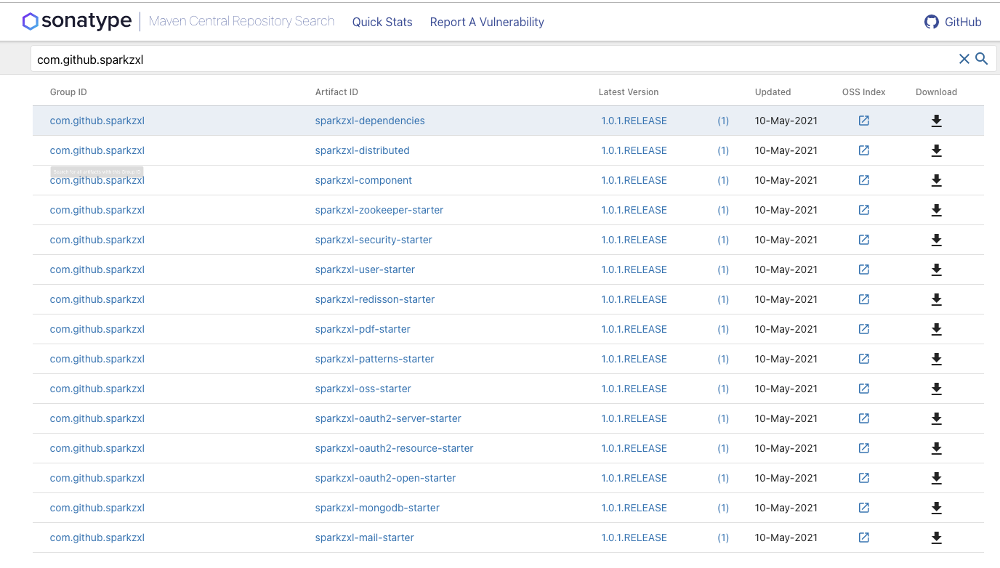

# sparkzxl-component学习教程

## 简介

> sparkzxl-component包含springboot项目的封装，主要功能是统一了对外接口的api访问格式，web模块进行了封装，基于DDD领域驱动模型设计代码，具体落地实施，对常用的工具类包进行封装，简单易用，elasticsearch，mybatis组件。集成了oauth2，redis缓存，本地缓存的构建，分布式锁的封装等等，是快速开发的脚手架，简易适用于企业级框架搭建

## 项目地址

[sparkzxl-component](https://github.com/sparkzxl/sparkzxl-component.git)

**落地最佳实践**：

- [sparkzxl-cloud](https://github.com/sparkzxl/sparkzxl-cloud.git)
- [sparkzxl-auth](https://github.com/sparkzxl/sparkzxl-auth.git)

## 在线体验

- [spark auth](http://119.45.182.28:3000/login)

!> 账户：admin 密码：123456

## 开源博客

- [凛冬王昭君的笔记](https://www.sparksys.top)

## 核心架构

## 未来展望

## 组件包依赖下载指引
> 组件jar包已上传maven中央仓库，可进入[maven中央仓库](https://search.maven.org/) 搜索下载

## 组件框架搭建

- [1.框架搭建手册之maven私库nexus实战](forward/框架搭建手册之maven私库nexus实战.md)
- [2.框架搭建手册之idea搭建代码环境](forward/框架搭建手册之idea搭建代码环境.md)

## 分布式架构篇

## 应用部署实践

- [1.Jenkins实战之流水线](forward/Jenkins实战之流水线.md)
- [2.Jenkins实战之流水线语法详解](forward/Jenkins实战之流水线语法详解.md)
- [3.Jenkins实战之流水线应用部署](forward/Jenkins实战之流水线应用部署.md)
- [4.链路追踪实战之SkyWalking环境搭建](forward/链路追踪实战之SkyWalking环境搭建.md)
- [5.链路追踪实战之JDK镜像制作](forward/链路追踪实战之JDK镜像制作.md)

## 组件功能介绍

- [sparkzxl-boot-starter组件](forward/sparkzxl-boot.md)
- [sparkzxl-cache-starter组件](forward/sparkzxl-cache.md)
- [sparkzxl-core组件](forward/sparkzxl-core.md)
- [sparkzxl-database-starter组件](forward/sparkzxl-database.md)
- [sparkzxl-user-starter组件](forward/sparkzxl-user.md)
- [sparkzxl-web-starter组件](forward/sparkzxl-web.md)

## 文档更新手册

- [文档更新手册](forward/文档更新手册.md)

# 公众号

学习不走弯路，关注公众号「凛冬王昭君」

