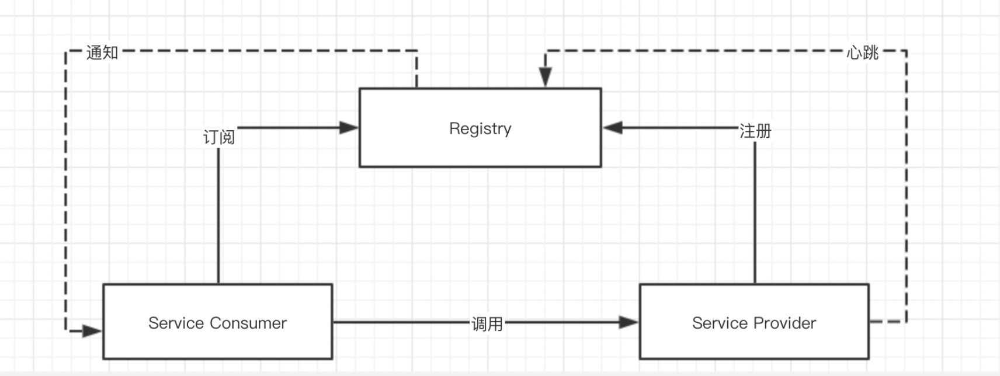

# 分布式架构之Spring Cloud Alibaba 注册中心 Nacos 入门

摘要: 原创出处 http://www.iocoder.cn/Spring-Cloud-Alibaba/Nacos-Discovery/ 「芋道源码」

## 1. 概述

本文我们来学习 [Spring Cloud Alibaba](https://spring.io/projects/spring-cloud-alibaba)
提供的 [Spring Cloud Alibaba Nacos Discovery](https://github.com/alibaba/spring-cloud-alibaba/wiki/Nacos-discovery) 组件，基于
Spring Cloud 的编程模型，接入 Nacos 作为注册中心，实现服务的注册与发现。
> [服务注册/发现: Nacos Discovery](https://github.com/alibaba/spring-cloud-alibaba/blob/master/spring-cloud-alibaba-docs/src/main/asciidoc-zh/nacos-discovery.adoc)
> - 服务发现是微服务架构体系中最关键的组件之一。如果尝试着用手动的方式来给每一个客户端来配置所有服务提供者的服务列表是一件非常困难的事，而且也不利于服务的动态扩缩容。
> - Nacos Discovery 可以帮助您将服务自动注册到 Nacos 服务端并且能够动态感知和刷新某个服务实例的服务列表。
> - 除此之外，Nacos Discovery 也将服务实例自身的一些元数据信息-例如 host，port, 健康检查URL，主页等内容注册到 Nacos。

在开始本文之前，胖友需要对 Nacos 进行简单的学习。可以阅读[《Nacos注册&配置中心搭建》](分布式架构之Nacos注册&配置中心搭建.md)文章，在本机搭建一个 Nacos 服务。

## 2. 注册中心原理

在开始搭建 Nacos Discovery 的示例之前，我们先来简单了解下注册中心的原理。

在使用注册中心时，一共有三种角色：服务提供者（Service Provider）、服务消费者（Service Consumer）、注册中心（Registry）。

> 在一些文章中，服务提供者被称为 Server，服务消费者被称为 Client。胖友们知道即可。

三个角色交互如下图所示：


① Provider：

- 启动时，向 Registry 注册自己为一个服务（Service）的实例（Instance）。
- 同时，定期向 Registry 发送心跳，告诉自己还存活。
- 关闭时，向 Registry 取消注册。

② Consumer：

- 启动时，向 Registry 订阅使用到的服务，并缓存服务的实例列表在内存中。
- 后续，Consumer 向对应服务的 Provider 发起调用时，从内存中的该服务的实例列表选择一个，进行远程调用。
- 关闭时，向 Registry 取消订阅。

③ Registry：

- Provider 超过一定时间未**心跳**时，从服务的实例列表移除。
- 服务的实例列表发生变化（新增或者移除）时，通知订阅该服务的 Consumer，从而让 Consumer 能够刷新本地缓存。

当然，不同的注册中心可能在实现原理上会略有差异。例如说，Eureka 注册中心，并不提供通知功能，而是 Eureka Client 自己定期轮询，实现本地缓存的更新。

另外，Provider 和 Consumer 是角色上的定义，一个服务同时即可以是 Provider 也可以作为 Consumer。例如说，优惠劵服务可以给订单服务提供接口，同时又调用用户服务提供的接口。

## 3. 快速入门

> 示例代码对应仓库：
> - 服务提供者：sparkzxl-nacos-discovery-provider
> - 服务消费者：sparkzxl-nacos-discovery-consumer

本小节，我们来搭建一个 Nacos Discovery 组件的快速入门示例。步骤如下：

首先，搭建一个服务提供者 sparkzxl-nacos-discovery-provider ，注册服务到 Nacos 中。

然后，搭建一个服务消费者 sparkzxl-nacos-discovery-consumer，从 Nacos 获取到 nacos-provider 服务的实例列表，选择其中一个示例，进行 HTTP 远程调用。

### 3.1 搭建服务提供者

创建 sparkzxl-nacos-discovery-provider 项目，作为服务提供者 nacos-provider。最终项目代码如下图所示：


#### 3.1.1 引入依赖

- 父pom

```xml
<?xml version="1.0" encoding="UTF-8"?>
<project xmlns="http://maven.apache.org/POM/4.0.0"
         xmlns:xsi="http://www.w3.org/2001/XMLSchema-instance"
         xsi:schemaLocation="http://maven.apache.org/POM/4.0.0 http://maven.apache.org/xsd/maven-4.0.0.xsd">
    <modelVersion>4.0.0</modelVersion>

    <groupId>com.github.sparkzxl</groupId>
    <artifactId>sparkzxl-cloud-learning</artifactId>
    <version>1.0-SNAPSHOT</version>
    <packaging>pom</packaging>

    <properties>
        <project.build.sourceEncoding>UTF-8</project.build.sourceEncoding>
        <project.reporting.outputEncoding>UTF-8</project.reporting.outputEncoding>
        <java.version>1.8</java.version>
        <!-- maven -->
        <maven.compiler.source>${java.version}</maven.compiler.source>
        <maven.compiler.target>${java.version}</maven.compiler.target>
        <maven-compiler-plugin.version>3.8.0</maven-compiler-plugin.version>
        <maven-resources-plugin.version>3.1.0</maven-resources-plugin.version>
        <maven-source-plugin.version>3.1.0</maven-source-plugin.version>
        <spring-boot-maven.version>2.3.5.RELEASE</spring-boot-maven.version>
        <mapstruct.version>1.4.0.CR1</mapstruct.version>

        <sparkzxl-dependencies.version>1.0.1.RELEASE</sparkzxl-dependencies.version>
        <lombok.version>1.18.8</lombok.version>
        <javafaker.version>1.0.2</javafaker.version>
    </properties>

    <modules>
        <module>sparkzxl-wechat-admin</module>
        <module>sparkzxl-account</module>
        <module>sparkzxl-admin-server</module>
        <module>sparkzxl-code-generator</module>
        <module>sparkzxl-order</module>
        <module>sparkzxl-product</module>
        <module>sparkzxl-sharding-demo</module>
        <module>sparkzxl-test-demo</module>
        <module>sparkzxl-sentinel-learn</module>
        <module>sparkzxl-kafka-learn</module>
        <module>sparkzxl-elasticsearch-learn</module>
        <module>sparkzxl-nacos-learn</module>
    </modules>

    <dependencies>
        <dependency>
            <groupId>org.projectlombok</groupId>
            <artifactId>lombok</artifactId>
            <version>${lombok.version}</version>
        </dependency>
    </dependencies>
    <dependencyManagement>
        <dependencies>
            <!-- sparkzxl-dependencies 依赖-->
            <dependency>
                <groupId>com.github.sparkzxl</groupId>
                <artifactId>sparkzxl-dependencies</artifactId>
                <version>${sparkzxl-dependencies.version}</version>
                <type>pom</type>
                <scope>import</scope>
            </dependency>
        </dependencies>
    </dependencyManagement>

    <build>
        <resources>
            <resource>
                <directory>src/main/resources</directory>
                <includes>
                    <include>**/*</include>
                </includes>
                <filtering>true</filtering>
            </resource>
            <resource>
                <directory>src/main/java</directory>
                <includes>
                    <include>**/*.xml</include>
                </includes>
                <filtering>true</filtering>
            </resource>
        </resources>

        <pluginManagement>
            <plugins>
                <!-- 提供给 mapstruct 使用 -->
                <plugin>
                    <groupId>org.apache.maven.plugins</groupId>
                    <artifactId>maven-compiler-plugin</artifactId>
                    <version>${maven-compiler-plugin.version}</version>
                    <configuration>
                        <source>${java.version}</source>
                        <target>${java.version}</target>
                        <annotationProcessorPaths>
                            <path>
                                <groupId>org.mapstruct</groupId>
                                <artifactId>mapstruct-processor</artifactId>
                                <version>${mapstruct.version}</version>
                            </path>
                            <path>
                                <groupId>org.projectlombok</groupId>
                                <artifactId>lombok</artifactId>
                                <version>${lombok.version}</version>
                            </path>
                        </annotationProcessorPaths>
                    </configuration>
                </plugin>
                <!-- resources资源插件 -->
                <plugin>
                    <groupId>org.apache.maven.plugins</groupId>
                    <artifactId>maven-resources-plugin</artifactId>
                    <version>${maven-resources-plugin.version}</version>
                    <configuration>
                        <delimiters>
                            <delimiter>@</delimiter>
                        </delimiters>
                        <useDefaultDelimiters>false</useDefaultDelimiters>
                        <encoding>UTF-8</encoding>
                        <!-- 后缀为pem、pfx的证书文件 -->
                        <nonFilteredFileExtensions>
                            <nonFilteredFileExtension>pem</nonFilteredFileExtension>
                            <nonFilteredFileExtension>pfx</nonFilteredFileExtension>
                            <nonFilteredFileExtension>p12</nonFilteredFileExtension>
                            <nonFilteredFileExtension>key</nonFilteredFileExtension>
                            <nonFilteredFileExtension>jks</nonFilteredFileExtension>
                            <nonFilteredFileExtension>db</nonFilteredFileExtension>
                            <nonFilteredFileExtension>txt</nonFilteredFileExtension>
                        </nonFilteredFileExtensions>
                    </configuration>
                </plugin>
                <!--配置生成源码包 -->
                <plugin>
                    <groupId>org.apache.maven.plugins</groupId>
                    <artifactId>maven-source-plugin</artifactId>
                    <version>${maven-source-plugin.version}</version>
                    <executions>
                        <execution>
                            <id>attach-sources</id>
                            <goals>
                                <goal>jar</goal>
                            </goals>
                        </execution>
                    </executions>
                </plugin>
                <!-- 打包 -->
                <plugin>
                    <groupId>org.springframework.boot</groupId>
                    <artifactId>spring-boot-maven-plugin</artifactId>
                    <version>${spring-boot-maven.version}</version>
                    <executions>
                        <execution>
                            <goals>
                                <goal>repackage</goal>
                            </goals>
                        </execution>
                    </executions>
                </plugin>
            </plugins>
        </pluginManagement>
        <plugins>
            <plugin>
                <groupId>org.apache.maven.plugins</groupId>
                <artifactId>maven-compiler-plugin</artifactId>
            </plugin>
            <!-- resources资源插件 -->
            <plugin>
                <groupId>org.apache.maven.plugins</groupId>
                <artifactId>maven-resources-plugin</artifactId>
            </plugin>
            <!--配置生成源码包 -->
            <plugin>
                <groupId>org.apache.maven.plugins</groupId>
                <artifactId>maven-source-plugin</artifactId>
            </plugin>
            <!-- 打包 -->
            <plugin>
                <groupId>org.springframework.boot</groupId>
                <artifactId>spring-boot-maven-plugin</artifactId>
            </plugin>
        </plugins>
    </build>
</project>

```

- sparkzxl-nacos-discovery-provider pom

```xml
<?xml version="1.0" encoding="UTF-8"?>
<project xmlns="http://maven.apache.org/POM/4.0.0"
         xmlns:xsi="http://www.w3.org/2001/XMLSchema-instance"
         xsi:schemaLocation="http://maven.apache.org/POM/4.0.0 http://maven.apache.org/xsd/maven-4.0.0.xsd">
    <parent>
        <artifactId>sparkzxl-nacos-learn</artifactId>
        <groupId>com.github.sparkzxl</groupId>
        <version>1.0-SNAPSHOT</version>
    </parent>
    <modelVersion>4.0.0</modelVersion>

    <artifactId>sparkzxl-nacos-discovery-provider</artifactId>

    <properties>
        <maven.compiler.source>8</maven.compiler.source>
        <maven.compiler.target>8</maven.compiler.target>
    </properties>

    <dependencies>
        <dependency>
            <groupId>com.github.sparkzxl</groupId>
            <artifactId>sparkzxl-boot-starter</artifactId>
            <exclusions>
                <exclusion>
                    <groupId>com.github.sparkzxl</groupId>
                    <artifactId>sparkzxl-database-starter</artifactId>
                </exclusion>
            </exclusions>
        </dependency>
        <dependency>
            <groupId>org.springframework.boot</groupId>
            <artifactId>spring-boot-starter-validation</artifactId>
        </dependency>
        <dependency>
            <groupId>com.alibaba.cloud</groupId>
            <artifactId>spring-cloud-starter-alibaba-nacos-discovery</artifactId>
        </dependency>
    </dependencies>
    <build>
        <plugins>
            <plugin>
                <groupId>org.springframework.boot</groupId>
                <artifactId>spring-boot-maven-plugin</artifactId>
            </plugin>
        </plugins>
    </build>
</project>
```

> 友情提示：有点小长，不要慌~

在 <dependencyManagement/> 中，我们引入了 sparkzxl-dependencies BOM 文件，进行依赖版本的管理，防止不兼容。 sparkzxl-dependencies BOM 文件中定义了Spring
Boot、Spring Cloud、Spring Cloud Alibaba 三者 BOM 文件，进行依赖版本的管理
在[《Spring Cloud 官方文档 —— 版本说明》](https://github.com/alibaba/spring-cloud-alibaba/wiki/版本说明) 文档中，推荐了三者的依赖关系。如下表格：

|Spring Cloud Version|Spring Cloud Alibaba Version|Spring Boot Version
|-------|-------|-------|
|Spring Cloud|2020.0|2021.1|
|Spring Cloud Hoxton.SR8|2.2.5.RELEASE|2.3.2.RELEASE|
|Spring Cloud Greenwich.SR6|2.1.4.RELEASE|2.1.13.RELEASE|
|Spring Cloud Hoxton.SR3|2.2.1.RELEASE|2.2.5.RELEASE|
|Spring Cloud Hoxton.RELEASE|2.2.0.RELEASE|2.2.X.RELEASE|
|Spring Cloud Greenwich|2.1.2.RELEASE|2.1.X.RELEASE|
|Spring Cloud Finchley|2.0.4.RELEASE(停止维护，建议升级)|2.0.X.RELEASE|
|Spring Cloud Edgware|1.5.1.RELEASE(停止维护，建议升级)|1.5.X.RELEASE|

- 这里，我们选择了 Spring Cloud Alibaba 版本为 2.2.5.RELEASE。
- 当前版版本下，我们使用的 Nacos 版本为 1.4.1。

引入 spring-cloud-starter-alibaba-nacos-discovery 依赖，将 Nacos 作为注册中心，并实现对它的自动配置。

#### 3.1.2 配置文件

创建 application.yaml 配置文件，添加 Nacos Discovery 配置项。配置如下：

```yaml
server:
  port: 8080
spring:
  application:
    name: nacos-provider # Spring 应用名
  cloud:
    nacos:
      # Nacos 作为注册中心的配置项，对应 NacosDiscoveryProperties 配置类
      discovery:
        server-addr: 127.0.0.1:8848 # Nacos 服务器地址
        service: ${spring.application.name} # 注册到 Nacos 的服务名。默认值为 ${spring.application.name}。
knife4j:
  enable: true
  description: sparkzxl nacos provider在线文档
  base-package: com.github.sparkzxl.nacos.controller
  group: nacos provider应用
  title: sparkzxl nacos provider在线文档
  terms-of-service-url: https://www.sparksys.top
  version: 1.0
  license: Powered By sparkzxl
  license-url: https://github.com/sparkzxl
  contact:
    name: zhouxinlei
    email: zhouxinlei298@163.com
    url: https://github.com/sparkzxl

```

重点看 spring.cloud.nacos.discovery 配置项，它是 Nacos Discovery 配置项的前缀，对应 NacosDiscoveryProperties 配置项。


#### 3.1.3 NacosProviderApplication

创建 DemoProviderApplication 类，创建应用启动类，并提供 HTTP 接口。代码如下

```java
package com.github.sparkzxl.nacos;

import com.github.sparkzxl.boot.SparkBootApplication;
import org.springframework.boot.SpringApplication;
import org.springframework.boot.autoconfigure.SpringBootApplication;

/**
 * description: nacos provider
 *
 * @author charles.zhou
 * @date 2021-05-11 10:41:35
 */
@SpringBootApplication(scanBasePackages = {"com.github.sparkzxl.nacos"})
public class NacosProviderApplication extends SparkBootApplication {

    public static void main(String[] args) {
        SpringApplication.run(NacosProviderApplication.class, args);
    }

}
```

```java
package com.github.sparkzxl.nacos.controller;

import com.github.sparkzxl.core.annotation.ResponseResult;
import io.swagger.annotations.Api;
import io.swagger.annotations.ApiOperation;
import org.springframework.web.bind.annotation.GetMapping;
import org.springframework.web.bind.annotation.RestController;

/**
 * description: test
 *
 * @author charles.zhou
 * @date 2021-05-11 10:47:54
 */
@RestController
@ResponseResult
@Api(tags = "测试")
public class TestController {

    @ApiOperation("echo")
    @GetMapping("/echo")
    public String echo(String name) {
        return "provider:" + name;
    }

}
```

① @SpringBootApplication 注解，被添加在类上，声明这是一个 Spring Boot 应用。Spring Cloud 是构建在 Spring Boot 之上的，所以需要添加。 ②
@EnableDiscoveryClient 注解，开启 Spring Cloud 的注册发现功能。不过从 Spring Cloud Edgware 版本开始，实际上已经不需要添加 @EnableDiscoveryClient
注解，只需要引入 Spring Cloud 注册发现组件，就会自动开启注册发现的功能。例如说，我们这里已经引入了 spring-cloud-starter-alibaba-nacos-discovery 依赖，就不用再添加
@EnableDiscoveryClient 注解了。
> - 拓展小知识：在 Spring Cloud Common 项目中，定义了 **DiscoveryClient** 接口，作为通用的发现客户端，提供读取服务和读取服务列表的 API 方法。而想要集成到 Spring Cloud 体系的注册中心的组件，需要提供对应的 DiscoveryClient 实现类。
> - 例如说，Spring Cloud Alibaba Nacos Discovery 提供了 **NacosDiscoveryClient** 实现，Spring Cloud Netflix Eureka 提供了 **EurekaDiscoveryClient** 实现。
> - 如此，所有需要使用到的地方，只需要获取到 DiscoveryClient 客户端，而无需关注具体实现，保证其通用性。

③ TestController 类，提供了 /echo 接口，返回 provider:${name} 结果。

#### 3.1.4 简单测试

① 通过 DemoProviderApplication 启动服务提供者，IDEA 控制台输出日志如：

```text
2021-05-11 10:56:17.503 application: nacos-provider  INFO 3665 TID: N/A --- [           main] c.a.c.n.r.NacosServiceRegistry           : nacos registry, DEFAULT_GROUP nacos-provider 172.34.67.31:8080 register finished
```

- 服务 **nacos-provider** 注册到 Nacos 上的日志。

② 打开 Nacos 控制台，可以在服务列表看到服务 nacos-provider。如下图：


### 3.2 搭建服务消费者
# 公众号

学习不走弯路，关注公众号「凛冬王昭君」


