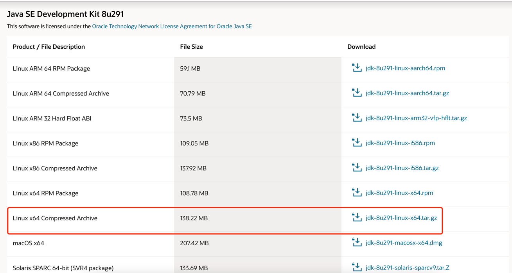
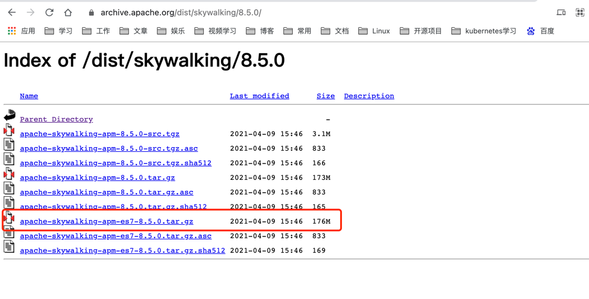

# 链路追踪实战之JDK镜像制作

## 1. SkyWalking搭建流程

在阅读本文章时，确保已经了解了sky walking基本搭建流程
- [链路追踪实战之SkyWalking极简入门](https://www.iocoder.cn/SkyWalking/install)
- [链路追踪实战之SkyWalking应用搭建](forward/链路追踪实战之SkyWalking环境搭建.md)

### 1.1 安装环境

|软件环境|简介|版本|RAM
|-------|-------|-------|-------|
|centos|Linux操作系统|7.8|8G|
|docker|docker虚拟化环境|20.10.6|8G|
|docker-compose|docker容器编排|1.29.1|8G|

### 1.2 下载jdk

官网下载路径:[javase-jdk8-downloads](https://www.oracle.com/cn/java/technologies/javase/javase-jdk8-downloads.html)

下载对应的系统的jdk版本，本文使用的是Linux操作系统

### 1.3 下载SkyWalking
官网下载路径:[skywalking 8.5.0](https://archive.apache.org/dist/skywalking/8.5.0/)

下载对应的版本包，如果使用的是es7作为skywalking 存储db，则需要es7对应的包文件

### 1.4 制作JDK镜像

- 新建Dockerfile
- JDK镜像构建
- 推送镜像
- 使用镜像
- 运行容器
